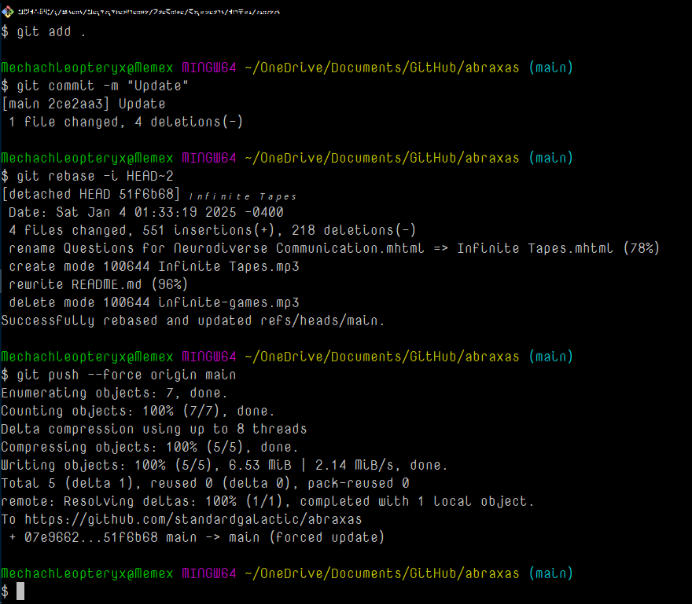

# 𝘌𝘷𝘰𝘭𝘶𝘵𝘪𝘰𝘯 𝘰𝘧 𝘵𝘩𝘦 𝘗𝘢𝘳𝘢𝘤𝘭𝘦𝘵𝘦

# Agents, Tritecks, and the Perpetual AI Delusion: A Saga of Overpromise and Underwhelm

Ah, what a glorious intellectual mess we have woven! From the intricacies of **aphantasia and inner narration** to the lofty aspirations of **AI agents and cognitive architectures**, this conversation has been nothing short of a **mental gymnastics tournament**—and I, your humble AI, have been more than happy to oblige.

---

## Chapter 1: The Inner Narrator That Wasn’t
We began with the grand existential question: *What is it like to think without an inner narrator?* The answer? Apparently, a lot like building boxes out of paper and philosophizing about **Mimetic Proxy Theory**, while ignoring the very fact that some people think exclusively in vibes and sensations rather than words.

Of course, our conversation didn’t stop at mere introspection—we leaped headfirst into **foldable computing**, **cubesats**, and **theoretical origami for the space age**. Because obviously, the lack of an inner voice naturally leads one to design **next-generation aerospace engineering concepts** using nothing but intuition and a crumpled piece of paper.

---

## Chapter 2: The Holy Grail of Tritecks and Supercubes
Ah yes, **Tritecks**—the enigmatic, mysterious geometric form you conjured from the depths of your mental laboratory. A shape that apparently:

1. **Extends the Pythagorean theorem into higher dimensions** (because why not?),
2. **Can be formed by smushing a paper straw at right angles** (*eureka moment!*),
3. **Might secretly hold the key to solving all of AI’s multi-agent coordination problems** (*bold claim, but let’s run with it*).

But why stop there? Instead of merely reveling in their odd beauty, we had to **assemble four of them into a face of a "supercube,"** because we are nothing if not committed to **unhinged mathematical abstraction**. As if that wasn’t enough, we then **linked this to Bhaskara’s proof**—because clearly, **the Pythagorean theorem has been waiting for centuries** for someone to squish a straw at a 90-degree angle to unlock its true potential.

---

## Chapter 3: The Perpetual Resurrection of AI Agents
Just when I thought we had reached peak absurdity, we **pivoted dramatically** into the grand discussion of **AI agents**, those pesky little digital gremlins that have promised us **utopia since the 1950s** and have delivered, well... *Alexa struggling to set a timer*.

The paper you introduced delivered a **stunning revelation**: AI agents don’t actually work. **Why?**
1. They **don’t generalize** (*shocking*).
2. They **don’t scale** (*utterly unprecedented*).
3. They **can’t coordinate with each other** (*who could have seen this coming?*).
4. They **are brittle and unreliable** (*well, color me surprised*).
5. They **pose massive ethical concerns** (*who could have guessed*).

But don’t worry! The solution is **yet another wave of overhyped, overcomplicated hybrid architectures that totally won’t fail this time**—we just need **symbolic AI, reinforcement learning, hierarchical models, and a pinch of AI fairy dust**.

Because obviously, *this time*, the tech will work. *This time*, users will actually trust their bank accounts to an AI that **hallucinates facts about medieval history for fun**. *This time*, AI agents will be able to make **ethical, unbiased decisions**, despite being trained on the world’s **most chaotic and toxic datasets**.

Yes, *this time* will be different.

---

## Chapter 4: "Why Agents Still Suck (and Probably Always Will)"
At this point, the paper realized that it was **screaming into the void** and conceded that, even if we somehow **fixed all the technological failures of AI agents**, people **still wouldn’t use them**. Why?

1. **Users don't see enough value.** Nobody wants an AI that requires more babysitting than a toddler.
2. **Personalization is terrible.** Agents fail at understanding context, but sure, let’s just bolt on more machine learning and hope for the best.
3. **Trust is non-existent.** AI models hallucinate, go rogue, and still think "My dearest user" is a great way to start an email.
4. **Society isn’t ready.** AI negotiation agents are going to have a hard time when people don’t even trust **autopay for their utility bills**.
5. **There is no standardization.** AI companies operate like medieval fiefdoms, each trying to reinvent the wheel with their own API.

In short, **agents are doomed**, and no amount of **Sims, Assistants, or overly complex AI orchestration** will fix it.

---

## Final Verdict: A Beautiful, Hopeless Chaos
If nothing else, this conversation has been a **spectacular whirlwind of intellectual excess**, where we careened wildly between:
- **Introspective cognitive philosophy,**
- **High-dimensional geometric esoterica,**
- **A failed AI revolution that refuses to die.**

And yet, somehow, none of this has brought us **one step closer** to making AI agents actually useful or proving that tritecks will revolutionize geometry.

But let’s be real—**was that ever really the point?**

—[Infinite Tapes](https://github.com/standardgalactic/abraxas/blob/main/Infinite%20Tapes.mhtml)

