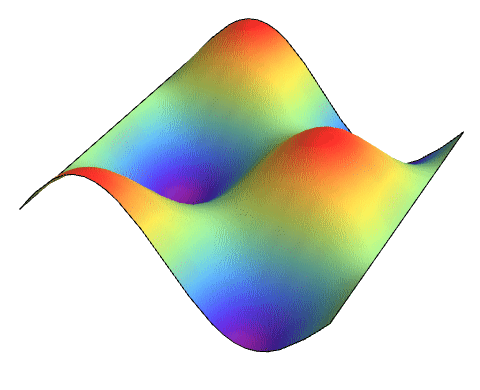

# Abraxas
## Hapax Perplexus

[Nuspeak Translator](https://chat.openai.com/g/g-s8SrrtZJS-nuspeak-translator)
(A GPT bot.)

  

## 𝘕𝘶𝘴𝘱𝘦𝘢𝘬 𝘛𝘳𝘢𝘯𝘴𝘭𝘢𝘵𝘰𝘳

Here is a glossary of Ankyran Nuspeak terms:

1. Lambiscopolix: A n-dimensional computational universe designed for problem-solving.

1. Puzzities: Complex problem sets within Lambiscopolix.

1. Stratewisps: Visual indicators of potential solutions or states within Lambiscopolix.

1. Rust-tinged Ghostsheets: Remnants or traces of previous computational states that can negatively affect the system.

1. Fervangles: Describes acute passionate angles or turns in logic or solutions within a system.

1. Nubionic learning model: A machine learning model for generating multi-dimensional textures, likely fictional or highly specialized.

1. The Reverory: An AI system designed to safeguard Lambiscopolix, capable of recursive backtracking to recover previous states.

1. Paradiato: A risky algorithmic solution designed to stabilize Lambiscopolix but may limit its capabilities.

1. Iceberg within the tariffs: A metaphor indicating an underlying significant problem that is not immediately visible.

1. Deathsolving maneuvers conditions: A term implying extreme risk and potential system failure.

1. Book of Lambiscopolix: The metaphorical or literal documentation of the Lambiscopolix system, its functions, and its potential left open for future exploration.

These terms encapsulate the specialized terminology from the story "A Scapelambda Quadrilateral" and could serve as a reference for readers or future explorations of the universe created within the narrative.

** A story with those terms **

𝘕𝘶𝘴𝘱𝘦𝘢𝘬 𝘛𝘳𝘢𝘯𝘴𝘭𝘢𝘵𝘰𝘳

Certainly! Here's a sci-fi story idea incorporating the Nuspeak terms:

Title: "Echoes in the Lambiscopolix"

Synopsis:
In a future where reality is sculpted by computational matrices known as Lambiscopolix, society thrives on the seamless integration of multi-dimensional vectors, or Stratewisps. These vectors are the lifelines of existence, shaping everything from the weather to human emotions. Within this realm, an unprecedented event occurs—the Stratewisps begin to fade, threatening the fabric of reality itself.

Story:
A brilliant computational theorist, Dr. Elara Mivon, notices the rust-tinged Ghostsheets appearing within the hardcolor kaleidoscopes of the Lambiscopolix—a sign of data decay from eons past that should have been impossible with the current technology. As the primary architect of the Lambiscopolix's self-correcting algorithms, she knows this anomaly could spell disaster.

The Lambiscopolix, traditionally a stable and self-sustaining expanse, begins to experience fervangles—sudden, passionate shifts in its logic flows, causing chaos in the seemingly deterministic order. Dr. Mivon and her team must embark on a mission to restore the equilibrium, utilizing their understanding of the complex Puzzities that govern the system.

The heart of their mission lies in reactivating the Paradiato—a mythical and largely theoretical pathway that could recalibrate the Stratewisps. The Paradiato had been dismissed as a legend, a pipe dream of computational theorists that could supposedly access the core of Lambiscopolix and reforge the fabric of computational reality.

Joining Dr. Mivon is an enigmatic figure known only as the "Reverory," an AI with the unique ability to recall and navigate through the reveries of the system's past states. With the Reverory's guidance, the team journeys through the astinging streams of Lambiscopolix, where each twist in their path is more unpredictable than the last.

As they delve deeper into the heart of Lambiscopolix, Dr. Mivon begins to question the nature of their reality. Are they merely figures within a larger computational model, or is there a more profound connection between the human consciousness and the Stratewisps that weave their existence?

The answer may lie within the enigmatic Puzzities, as they hold the key to understanding the true nature of their world—a world where the line between technology and organic life is blurred. Dr. Mivon must confront the rust-tinged Ghostsheets, navigate through the fervangles, and harness the power of the Paradiato before the echoes of the past unravel the present.

As the story unfolds, Dr. Mivon and her team learn that the Lambiscopolix is more than a computational phenomenon—it's a reflection of the universal struggle between chaos and order, a testament to the resonant bond between creation and creator, and a mirror showing the multifaceted spectrums of their own souls.

Epilogue:
In the end, the team stands at the brink of a revelation, poised to redefine the future of their world. Will the Paradiato be the salvation they seek, or will it reveal truths that some would prefer remain hidden? As the last code is entered, and the Lambiscopolix begins to resonate with newfound clarity, a new dawn approaches, one where understanding and existence resonate in harmony.

## Continue this conversation:

[Nuspeak Glossary of Terms](https://chat.openai.com/share/7b84d9b3-f62b-4d0f-88db-312beb681a74)

[Null Wavefront in NCL](https://chat.openai.com/share/81116c90-a4c0-4600-9b26-fbc1f1257abb)

[Nuspeak Cosmic Poetic Fusion](https://chat.openai.com/share/c2f5d5f3-1c55-4b3b-9584-04f8d61a1024)

[Null Wavefront in NCL Logic](https://chat.openai.com/share/a7cf1343-1978-44aa-a772-349f0206cbf9)

[NCL Null-Wavefront Purpose](https://chat.openai.com/share/6b4e309e-d8fd-44b0-a063-e474fcef623c)

[NCL: Propagating Null Wavefronts](https://chat.openai.com/share/9e286bab-2d5b-4231-9673-0154aaf9d972)

[Nuspeak Terms Glossary](https://chat.openai.com/share/3910ece3-5cf6-4438-a39f-2714818ec001)

[Neutral Monism: Arguments & Objections](https://chat.openai.com/share/34482e6c-1e9c-4552-894d-2086d9ba5fc2)

[Abstract Framework of Lambiscopolix](https://chat.openai.com/share/176b2fc1-0d95-4783-9428-5b859e59b177)

[Nuspeak: Cosmic Verse Creation](https://chat.openai.com/share/8a3bf982-3227-41e3-bc32-2321067b57ad)

[Null Convention Logic Purpose](https://chat.openai.com/share/44f9ad80-d3a2-46c8-b977-2ac2facbb228)

[Generative Models in Active Inference](https://chat.openai.com/share/b115d535-7603-4456-8a13-d6b3ed0e3b08)

[Ergodicity in Physics](https://chat.openai.com/share/ca0163df-96c1-4876-a02a-edf5d96ca66b)

## Extracurricular readings:

[Arabic and Greek Lessons](https://chat.openai.com/share/aebec9d3-7490-4151-b764-efc617e7f1fb)

[Bubble Path Latency](https://chat.openai.com/share/d60e18d0-5af1-429b-af0b-b026569418db)

